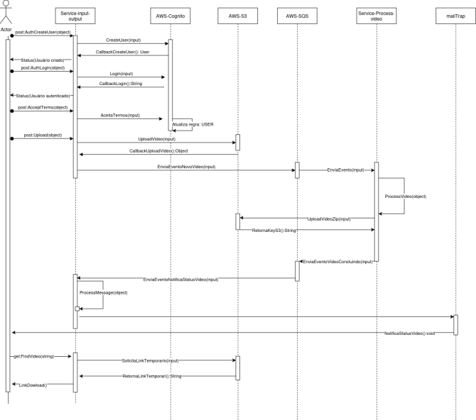
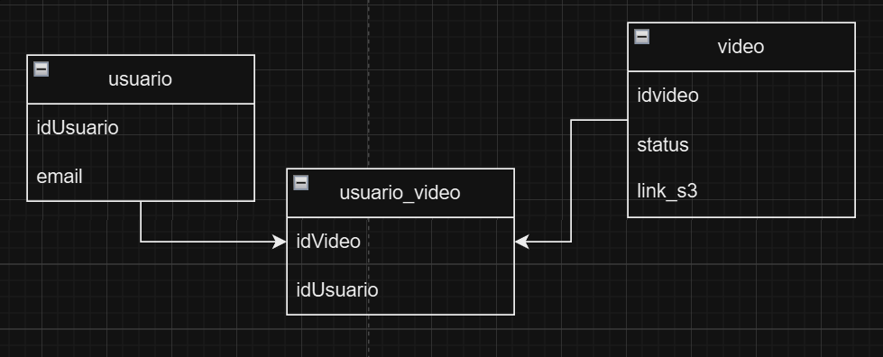

# Hackaton - Software Architecture

O projeto foi desenvolvido no âmbito da pós graduação em Software Architecture da Fiap. Dado um contexto e um problema (descritos abaixo), foi desenvolvida uma solução, utilizando os conteúdos aprendidos no curso

## 1. Visão Geral do Sistema

O sistema tem como objetivo gerenciar o upload, processamento e notificação de vídeos para usuários autenticados. Ele é baseado em uma arquitetura de microsserviços utilizando serviços da AWS, como Cognito, S3 e SQS, e um banco de dados Postgres para armazenamento relacional.

## 2. Arquitetura do Sistema

### Componentes Principais

- AWS Cognito: Gerenciamento de autenticação e autorização dos usuários.

- Service Input/Output: Responsável pelo controle de upload de vídeos, comunicação com o banco de dados e envio de notificações aos usuários sobre o status dos vídeos

- Bucket S3: Armazena os vídeos enviados pelos usuários.

- Service Process Video: Processa os vídeos após o upload.

- SQS Process: Fila para gerenciar as mensagens de processamento de vídeo.

- SQS Notification: Fila para disparar envio de notificações de erro ou sucesso aos usuários.

- Banco de dados: Armazena informações sobre usuários e vídeos.

## 3. Microsserviços

### 3.1 Service Input/Output

Funcionalidade: Autenticação via Cognito, upload de vídeos para o S3, registro no banco de dados, consumo de mensagens da fila SQS Notification e envio notificações (e-mail) aos usuários.

POST /auth/login - Autenticar o usuário

POST /upload - Envia vídeos para o S3

POST /auth/accept-terms - Para aceite dos termos de serviço

GET /videos - Lista vídeos do usuário 

### 3.2 Service Process Video

Funcionalidade: Consome mensagens da fila SQS Process, processa os vídeos e atualiza o status na fila.

Processo: Download do S3, processamento, upload do resultado e atualização do status.

## 4. Modelagem de Dados

## 5. Fluxos de Trabalho

### 5.1 Upload e Processamento de Vídeo

- Usuário faz seu cadastro login via Cognito.

- Usuário recebe um e-mail com a notificação.

- O sistema solicita o aceite do formulário de consentimento LGPD

- Após o aceite, o campo lgpd_consentimento é atualizado para true no perfil do usuário

- O usuário está apto a realizar o upload de vídeos.

- Usuário envia vídeo através do Service Input/Output.

- O vídeo é armazenado no S3.

- Uma mensagem é publicada na fila SQS Process.

- O Service Process Video consome a mensagem, processa o vídeo e atualiza o status publicando uma mensagem na fila SQS Notification.

- O Service Input/Output consome a mensagem e notifica o usuário.

- O vídeo processado fica disponível para o usuário no S3.

## 6. Segurança e LGPD

- Autenticação: AWS Cognito para gerenciamento de usuários.

- Autorização: Regras de IAM e políticas de bucket S3.

- Criptografia: Dados em trânsito e em repouso criptografados.

- Proteção de Endpoints: Apenas usuários autenticados podem acessar o sistema.

- LGPD: O sistema apenas processa dados pessoais com base em consentimento explícito ou outras bases legais previstas na LGPD.

## 7. Escalabilidade e Resiliência

Processamento Paralelo: O sistema processa múltiplos vídeos simultaneamente.

Mensageria Resiliente: SQS configurado para alta disponibilidade.

Arquitetura Desacoplada: Microsserviços independentes que facilitam o escalonamento horizontal.

## 8. CI/CD

Versionamento: Código hospedado no GitHub.

- [Repositório Service Process Video ](https://github.com/SaraAWatanabe-org/Service-process-video-Fase-5)

- [Repositório Service Input Output](https://github.com/SaraAWatanabe-org/Service-input-output-Fase-5)

- [Repositório Infra](https://github.com/SaraAWatanabe-org/Infra-Fase-5)

Pipeline de CI/CD: Automatização de build, testes e deploy utilizando GitHub Actions.

Ambientes: Separação de ambientes de desenvolvimento e produção.

## 9. Guia de Deploy

Infraestrutura: Provisionamento do cluster EKS utilizando Terraform.

Microsserviços: Deployment automatizado via GitHub Actions

## 10. Testes

Testes Unitários: Implementados para cada serviço.

Testes de Integração: Validação do fluxo completo de upload, processamento e notificação.

Cobertura de Testes: Garantia de qualidade através de uma cobertura mínima de 80%. Validação em tempo de CI, e Integração com o SonarCloud.

## 11. Entregáveis

(Inserir aqui o link para o Vídeo)
